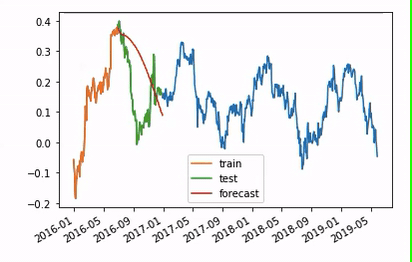
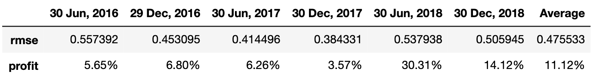

# Stock Data Prediction

  An architecture to test univariate as well as multivariate time series machine learning models on fundamental and technical data with the option of testing the model in real time web scraped data.  
  

# Data
US Stock Market data was taken from https://simfin.com/ for five years and for 2307 stocks and for 61 features including Share Price, Dividends,Market capitalisation etc and was store in Total-Data.csv in the Data folder. A subset of the total data was taken for a period of 4 years from 2015-07-01 to 2019-07-01. A certain number of 23 features were taken ( included in the var array in data.py ) and the stocks with missing data were removed. This left us with 1649 stocks stored in the Stocks.csv in the Data folder. The return each stock gave was calculated using given data and the data was indexed according do available date-time stamps for Share Price data. Each of the parameters were stored in a time series with a rolling window taken to be 6 months.

# Preprocessing
1. **Outliers**: Certain stocks have excessively large feature which if sclaed reduce the influence of the other stocks. Hence the stocks are removed manually. Using the zscore elimination method might also remove other data before removing the outlier if the effect of the outlier is trememdous ( as it shifts the mean towards itself ) as was observed in some cases. Thus values with the maximum absolute magnitude are removed based on the number inputted in the values array in Outliers.py.

  

2. **Missing values**: A 8 fold cross validation split was taken for the data and hence it is necessary to make sure that each split had data available for all feature. After removal of the above steps there were 1022 stocks that the algorithm was run on.

3. **Stationarity and Normalization**: The testing feature ( Return on stock ) is already differenced and was found to be stationary with the data mostly centered around zero. Differencing the other feature resulted in the features becoming extremely small in which case multi step forecasting in the model causes the predicted values to diverge and become extremely large in some cases.

# Testing

 
  Time Series Nested Cross Validation  
  

Time Series Cross validation as opposed to conventional k fold cross validation takes the continuity of data into consideration. An 8 split cross validation was taken with each split , however the rolling window values were only assumed to be valid 6 months after the start time and the last 6 months were not taken for testing due to lack of test data. This in effect the data is trained and tested 6 times. 
the multivariate time series Vector Autoregression Model ( VAR ) was taken, however any multivariate or univariate model can be tested on the data. The hyperparameter maxlags was set to 2. As most stocks consistenly performed wel at the given value there was no need for a nested cross validation approach where the possible parameter grid is tested on the validation set and the best hyperparameter is taken for testing.

&nbsp;

  

# Scoring
The scoring was based on the root mean squared error ( rmse ) metric and the estimated profit for the portfolio. The profit was calculated assuming the weights assigned to each stock is on the basis of projected profit and the stocks have perfect short and long conditions.

 
  

